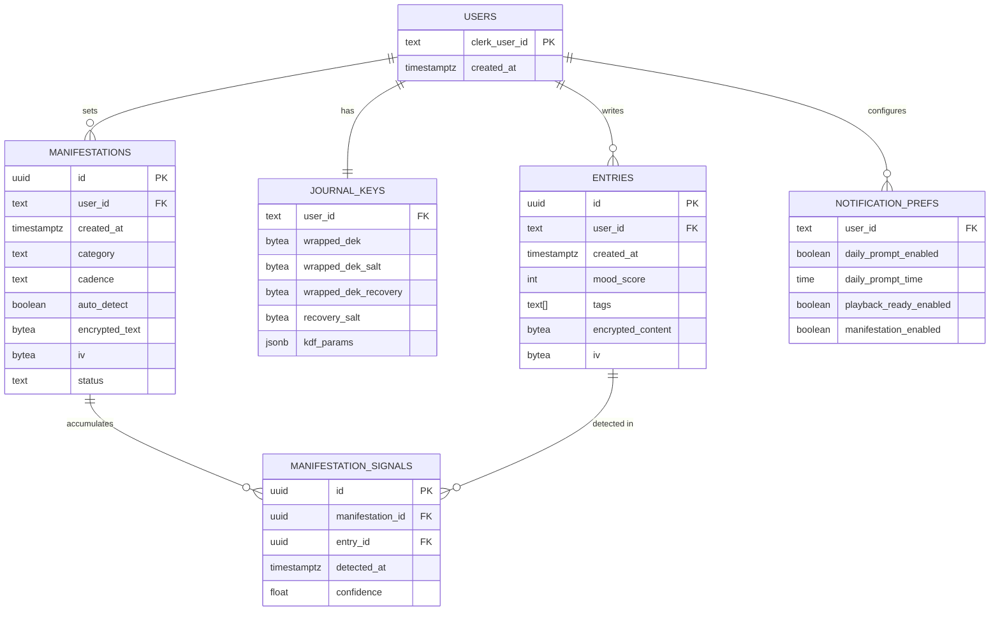
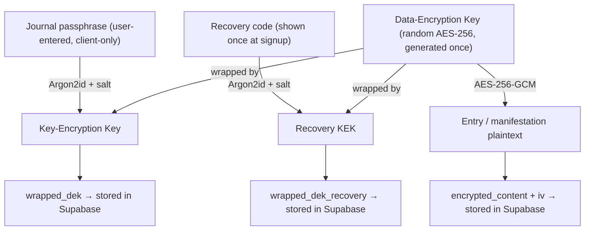
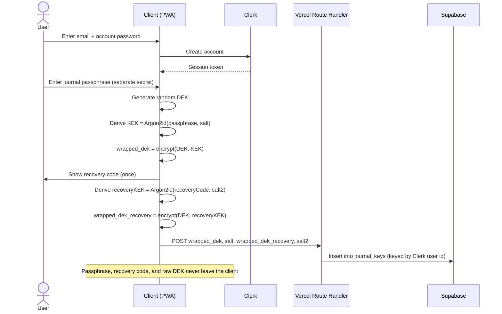
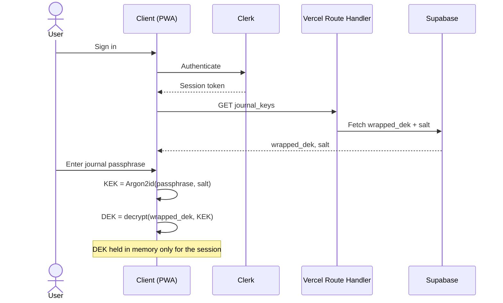
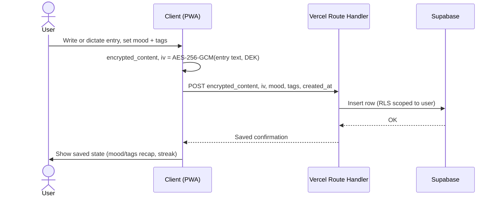
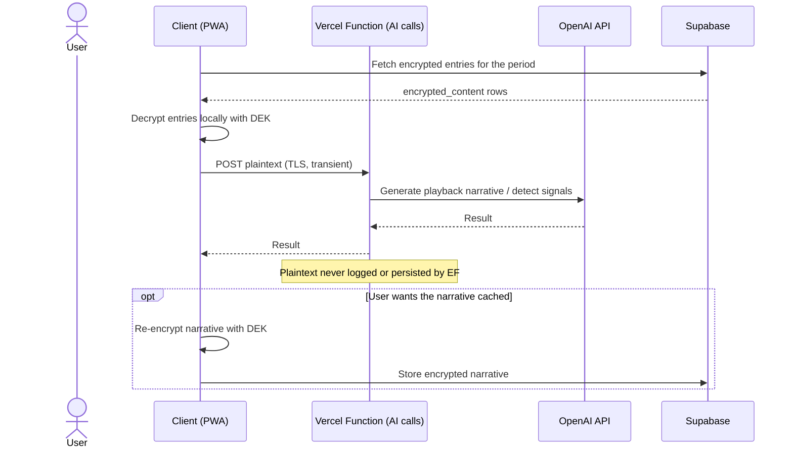
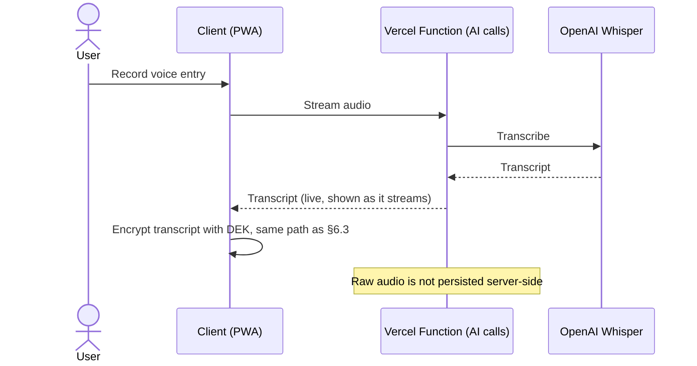
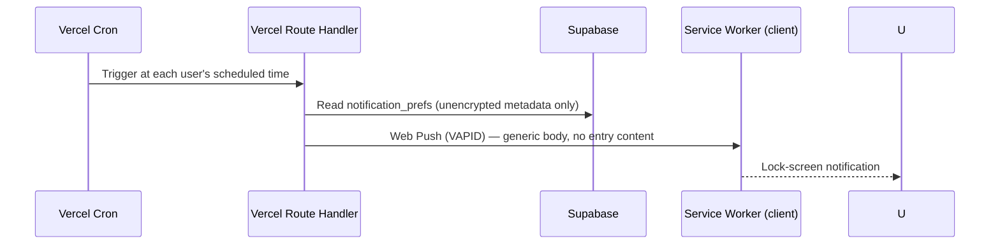
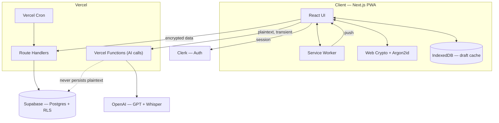

# The Nook — Product & Architecture Reference

Status: pre-build design reference. This document is the source of truth for product intent, data model, and system architecture. Treat it as the base context for implementation — human or AI agent.

## 1. Product summary

The Nook is a mobile-first, AI-assisted journaling app. Users write (or speak) daily entries; the app's distinguishing feature is turning that archive into reflection — surfacing patterns, playing back growth over time, and reinforcing the user's own stated intentions ("manifestations") using their own words, not generic affirmations.

Design direction: light, calm, "sage" palette (soft green hills / forest motif), explicitly not the violet/gradient look common to AI products. Full mobile screen flow and visual reference: see the published [Journal App Mobile Flow](https://claude.ai/code/artifact/36d63c97-7c7c-4fd6-8234-b35ea36ed857) design canvas — this document should be read alongside it, not instead of it.

## 2. Core features

| Feature | Summary |
|---|---|
| Journaling | Text or voice entry, mood scale, freeform tags, AI-suggested daily prompt |
| Tone selection | User picks the AI's voice — Coach, Friend, Mirror, or Minimal — set once, editable anytime |
| Playback | Story-format recap (week / month / year), swipeable cards: mood trend, highlighted quote, then-vs-now comparison, a "letter from past self" |
| Manifestations | User-authored goals/affirmations; AI passively detects signals of progress in new entries and resurfaces the manifestation when relevant |
| Full-entry reading | Long-form reader for any past entry, reachable from the journal list or from inside a playback card |
| Reminders | Opt-in, low-frequency notifications (daily prompt, playback ready, manifestation resurfaced) — explicitly no streak-shaming or "we miss you" messaging |
| Privacy | Entries are unreadable to the operator by design (see §5) |

## 3. Tech stack

| Layer | Choice | Why |
|---|---|---|
| Client | Next.js (App Router, TypeScript), mobile-first PWA | One codebase, installable to home screen, no app-store review cycle |
| Styling | Tailwind CSS | Maps directly to the sage design tokens; fast for a solo builder |
| Client state | Zustand (local/session state) + TanStack Query (server state/cache) | Minimal boilerplate at this scale |
| Offline | Serwist (Workbox's App Router-compatible successor) for app-shell caching, IndexedDB for draft entries in progress | Entries in progress shouldn't be lost on a dropped connection |
| Hosting / backend | Vercel — Next.js Route Handlers as the API, Vercel Functions (Node.js runtime) for AI calls, Vercel Cron for scheduled notifications | No servers to operate solo; generous free tier |
| Database | Supabase (managed Postgres) with Row-Level Security | One vendor for DB + storage; RLS keyed off the authenticated user |
| Auth | Clerk — hosted sign-up/sign-in UI, session management, social login | Polished auth with minimal build effort; integrates natively with Supabase RLS via Clerk-as-external-auth-provider support |
| Encryption | Web Crypto API (AES-256-GCM) + Argon2id (via `hash-wasm`), entirely client-side | See §5 — this is the one piece that is not "just a managed service" |
| AI — text | OpenAI (GPT-4o-mini class model) | Prompts, playback narratives, manifestation-signal detection |
| AI — voice | OpenAI Whisper | Voice-entry transcription; same vendor/key as text AI |
| Notifications | Web Push (VAPID), triggered by Vercel Cron | Native-feeling reminders from a PWA |

Explicit non-choice: no separate backend framework/service — Next.js Route Handlers + Vercel Functions are the entire backend at this scale.

## 4. Data model

Two identity systems are intentionally decoupled: **Clerk** owns "who is this user" (account, session, login password). **Supabase** owns "what does this user's journal contain," keyed by the Clerk user ID, and never sees the login password or the journal passphrase.

Design rule: only the metadata a query genuinely needs (mood score, tags, timestamps, cadence/status flags) is stored in the clear. Anything that is the user's actual words — entry content, manifestation text — is stored only as `(encrypted_content, iv)`, encrypted client-side before it ever reaches the network.

## 5. Encryption architecture

The threat model: the operator (database, backend code, and anyone who compromises either) should not be able to read journal entries, even under legal compulsion or a data breach.

Two independent secrets, by design:

- **Account password** (Clerk) — proves who you are. A reset here does not touch journal data.
- **Journal passphrase** (app-specific, set in a dedicated onboarding step, distinct from Clerk) — the only thing that unlocks entries. There is no server-side reset path; losing it and the recovery code means permanent loss of the archive. This is a stated tradeoff, not an oversight — see the Recovery Code screen copy in the design canvas.

Consequences that follow from this model, worth stating explicitly for implementation:

1. **The server never persists plaintext.** The one exception is transient, in-memory handling during an AI call (§6.4) — never logged, never written to disk or a database row.
2. **AI-generated output derived from plaintext is itself sensitive.** A playback narrative or a detected manifestation signal is generated from decrypted content. If it's cached server-side for reuse, it must be re-encrypted client-side with the DEK before that round-trip — it does not get a free pass just because the AI produced it rather than the user.
3. **No multi-device sync of the DEK is specified yet.** Today, unlocking on a new device means re-entering the journal passphrase to re-derive the KEK and unwrap the same `wrapped_dek` row. This works, but see §8 for what it doesn't yet handle.

## 6. Sequence diagrams

### 6.1 Account signup + journal passphrase setup

### 6.2 Login + unlock

### 6.3 Create a journal entry

### 6.4 AI prompt / playback generation

### 6.5 Voice entry

### 6.6 Daily reminder notification

Note: the lock-screen mockup in the design canvas shows descriptively rich preview text (e.g. quoting the day's prompt). That's illustrative of the *feature*, not a settled decision — see the open question in §8 about notification content richness vs. lock-screen exposure.

## 7. System architecture

## 8. Security boundaries & explicit non-goals

- The database and backend code never store readable entry content. The only place plaintext exists outside the client is transiently inside a Vercel Function during an AI call.
- Account password (Clerk) and journal passphrase are independent. Compromising or resetting one does not expose data protected by the other.
- There is no "forgot journal passphrase" server-side reset. The recovery code is the only backup path, by design — this is a stated cost of the privacy model, not a gap to close.
- Not yet addressed (flag before building the relevant screen):
  - **Notification content richness vs. lock-screen privacy.** The lock-screen mockup shows descriptive previews; decide whether shipped notifications stay generic ("Time to reflect") or allow rich previews with a Settings toggle to suppress them on the lock screen.
  - **Multi-device key handling.** Today: re-enter the passphrase per device. No QR-code device-linking or secure sync flow is designed yet.
  - **Data export / account deletion.** Needed for basic user trust and likely for compliance; not yet designed.
  - **Whisper audio retention.** Currently specified as not persisted server-side — confirm this holds once voice entries are implemented, since it affects that function's implementation, not just policy.
  - **Offline write conflict handling.** IndexedDB holds drafts written offline; the sync-back behavior on reconnect (retry order, conflict resolution) isn't designed yet.

## 9. Screen inventory

Full visual reference: [Journal App Mobile Flow](https://claude.ai/code/artifact/36d63c97-7c7c-4fd6-8234-b35ea36ed857).

| Screen | Purpose |
|---|---|
| Account signup (Clerk-style) | Email/password or social login, creates the Clerk account |
| Journal passphrase setup | Sets the separate encryption secret |
| Recovery code | One-time display of the account's only backup path |
| Tone selection | Coach / Friend / Mirror / Minimal |
| Notification permission | Soft pre-permission ask, per-notification-type toggles |
| Lock screen notification (mockup) | Illustrates push notification appearance |
| Home | Daily prompt, mood check-in, streak, recent entries |
| Journal list | Dated list of past entries, grouped by month |
| Entry detail | Long-form reader for a full past entry |
| Entry composer | Text entry with mood + tags |
| Entry composer — voice | Live waveform, timer, streaming transcript |
| Entry composer — saved | Confirmation state, privacy reassurance, streak update |
| Playback hub | Week/month/year recap selector |
| Playback story cards (×4) | Mood trend, highlighted quote, then-vs-now, letter from past self |
| Manifestations list | Goals with AI-detected progress signals |
| Manifestation add/edit | Goal text, category, resurfacing cadence, auto-detect toggle |
| Settings | Tone, encryption/privacy, notifications, account |
