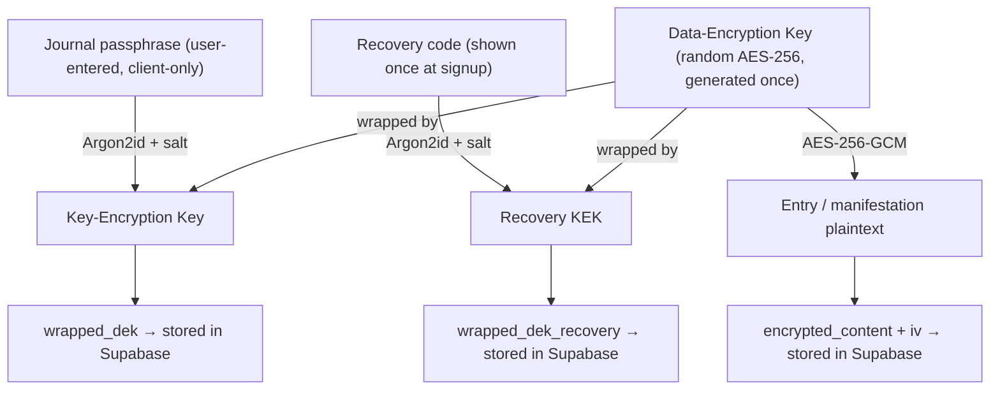
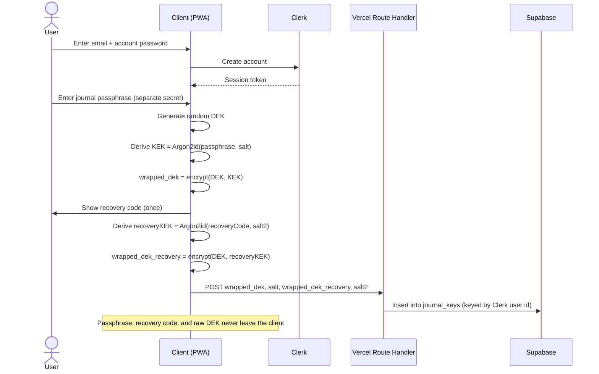
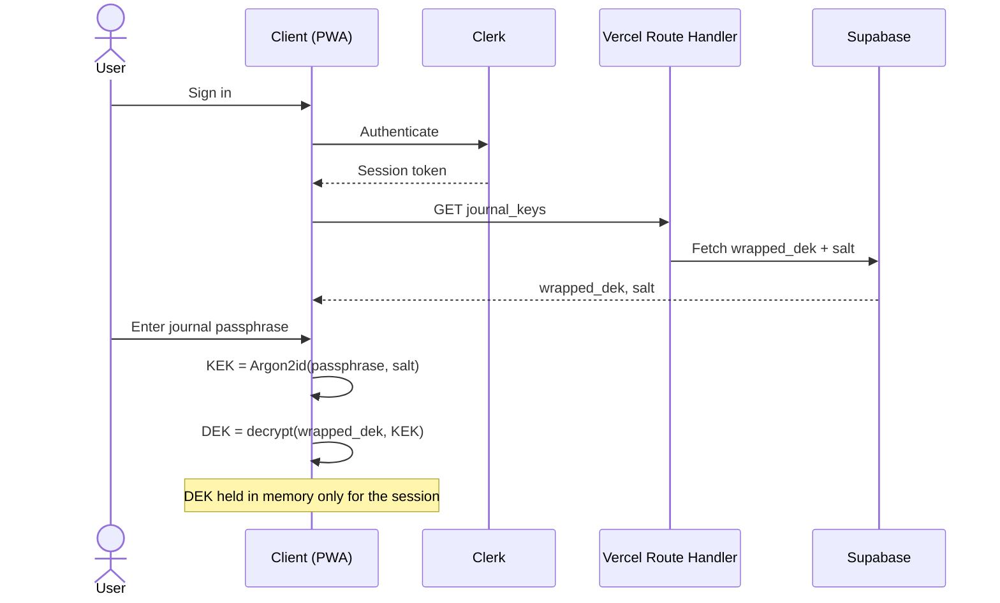
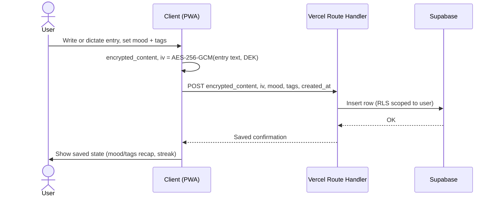
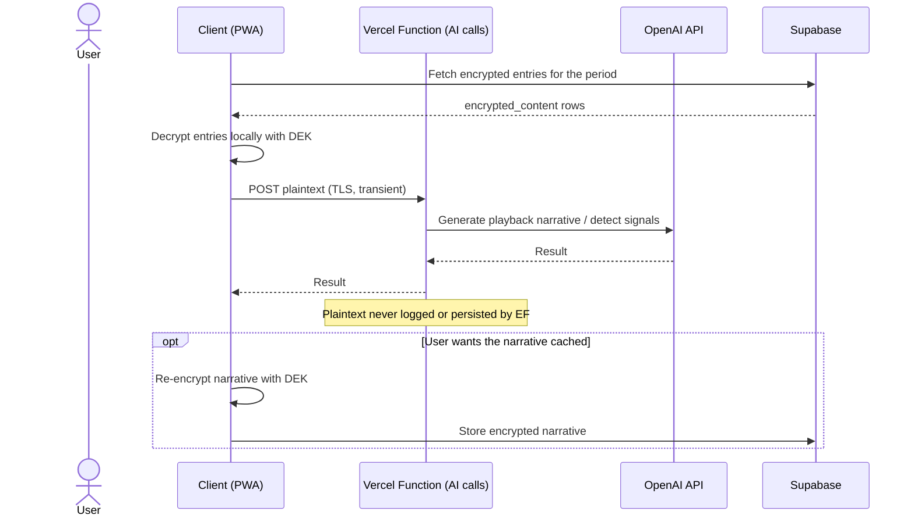
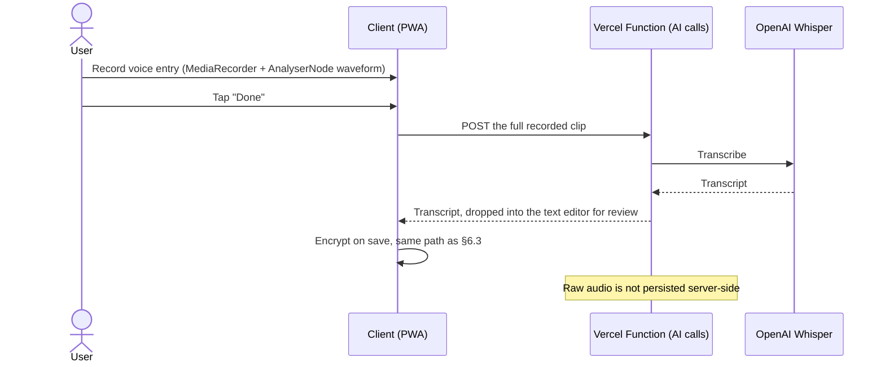
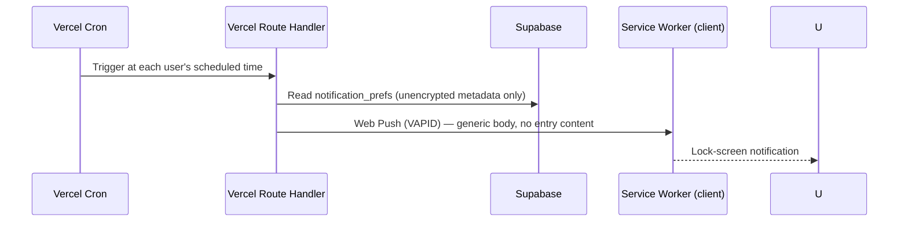
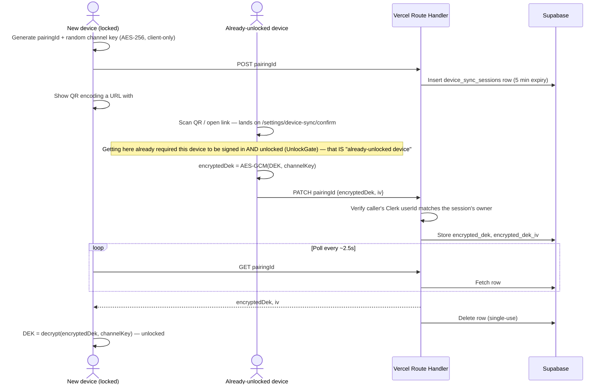
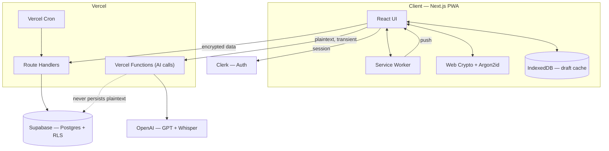

# The Nook — Product & Architecture Reference

Status: implemented. Every screen in the design canvas is built and wired to real data — see [`web/README.md`](../web/README.md) for the concrete "what's built" list and the honest remaining-gaps list. This document stays the source of truth for product intent, data model, and system architecture; treat it as the base context for implementation — human or AI agent.

## 1. Product summary

The Nook is a mobile-first, AI-assisted journaling app. Users write (or speak) daily entries; the app's distinguishing feature is turning that archive into reflection — surfacing patterns, playing back growth over time, and reinforcing the user's own stated intentions ("manifestations") using their own words, not generic affirmations.

Design direction: light, calm, "sage" palette (soft green hills / forest motif), explicitly not the violet/gradient look common to AI products. Full mobile screen flow and visual reference: see the published [Journal App Mobile Flow](https://claude.ai/code/artifact/36d63c97-7c7c-4fd6-8234-b35ea36ed857) design canvas — this document should be read alongside it, not instead of it.

## 2. Core features

| Feature | Summary |
|---|---|
| Journaling | Text or voice entry, mood scale, freeform tags, AI-suggested daily prompt |
| Tone selection | User picks the AI's voice — Coach, Friend, Mirror, or Minimal — set once, editable anytime |
| Playback | Story-format recap (week / month / year), swipeable cards: mood trend, highlighted quote, then-vs-now comparison, a "letter from past self" |
| Manifestations | User-authored goals/affirmations; AI passively detects signals of progress in new entries and resurfaces the manifestation when relevant |
| Full-entry reading | Long-form reader for any past entry, reachable from the journal list or from inside a playback card |
| Reminders | Opt-in, low-frequency notifications (daily prompt, playback ready, manifestation resurfaced) — explicitly no streak-shaming or "we miss you" messaging |
| Privacy | Entries are unreadable to the operator by design (see §5) |

## 3. Tech stack

| Layer | Choice | Why |
|---|---|---|
| Client | Next.js (App Router, TypeScript), mobile-first PWA | One codebase, installable to home screen, no app-store review cycle |
| Styling | Tailwind CSS | Maps directly to the sage design tokens; fast for a solo builder |
| Client state | Zustand (local/session state) + TanStack Query (server state/cache) | Minimal boilerplate at this scale |
| Offline | Serwist (Workbox's App Router-compatible successor) for app-shell caching, IndexedDB for draft entries in progress | Entries in progress shouldn't be lost on a dropped connection |
| Hosting / backend | Vercel — Next.js Route Handlers as the API, Vercel Functions (Node.js runtime) for AI calls, Vercel Cron for scheduled notifications | No servers to operate solo; generous free tier |
| Database | Supabase (managed Postgres) with Row-Level Security | One vendor for DB + storage; RLS keyed off the authenticated user |
| Auth | Clerk — hosted sign-up/sign-in UI, session management, social login | Polished auth with minimal build effort; integrates natively with Supabase RLS via Clerk-as-external-auth-provider support |
| Encryption | Web Crypto API (AES-256-GCM) + Argon2id (via `hash-wasm`), entirely client-side | See §5 — this is the one piece that is not "just a managed service" |
| AI — text | OpenAI (GPT-4o-mini class model) | Prompts, playback narratives, manifestation-signal detection |
| AI — voice | OpenAI Whisper | Voice-entry transcription; same vendor/key as text AI |
| Notifications | Web Push (VAPID), triggered by Vercel Cron | Native-feeling reminders from a PWA |

Explicit non-choice: no separate backend framework/service — Next.js Route Handlers + Vercel Functions are the entire backend at this scale.

## 4. Data model

Two identity systems are intentionally decoupled: **Clerk** owns "who is this user" (account, session, login password). **Supabase** owns "what does this user's journal contain," keyed by the Clerk user ID, and never sees the login password or the journal passphrase.

Design rule: only the metadata a query genuinely needs (mood score, tags, timestamps, cadence/status flags) is stored in the clear. Anything that is the user's actual words — entry content, manifestation text — is stored only as `(encrypted_content, iv)`, encrypted client-side before it ever reaches the network.

Ciphertext/key-material columns are `text` (base64), not `bytea` — see `0002_ciphertext_as_text.sql`. The original `bytea` choice assumed Postgres would hold raw binary, but everything in `src/lib/crypto` produces base64 strings for JSON transport anyway, and PostgREST's `bytea` wire format (hex-encoded) doesn't match that without extra encoding work that buys nothing here.

`device_sync_sessions` (`0003_device_sync.sql`) is deliberately ephemeral — see §5's multi-device note and §6.7.

## 5. Encryption architecture

The threat model: the operator (database, backend code, and anyone who compromises either) should not be able to read journal entries, even under legal compulsion or a data breach.

Two independent secrets, by design:

- **Account password** (Clerk) — proves who you are. A reset here does not touch journal data.
- **Journal passphrase** (app-specific, set in a dedicated onboarding step, distinct from Clerk) — the only thing that unlocks entries. There is no server-side reset path; losing it and the recovery code means permanent loss of the archive. This is a stated tradeoff, not an oversight — see the Recovery Code screen copy in the design canvas.

Consequences that follow from this model, worth stating explicitly for implementation:

1. **The server never persists plaintext.** The one exception is transient, in-memory handling during an AI call (§6.4) — never logged, never written to disk or a database row.
2. **AI-generated output derived from plaintext is itself sensitive.** A playback narrative or a detected manifestation signal is generated from decrypted content. If it's cached server-side for reuse, it must be re-encrypted client-side with the DEK before that round-trip — it does not get a free pass just because the AI produced it rather than the user.
3. **Multi-device sync doesn't touch this model at all — it's a parallel path.** Re-entering the passphrase always works (same `wrapped_dek` row, any device). For a faster handoff, an already-unlocked device can transmit the DEK to a new one via a short-lived, server-relayed exchange encrypted under a one-time "channel key" that's generated on the new device and never sent to the server — see §6.7. The server only ever holds that ciphertext, briefly.

## 6. Sequence diagrams

### 6.1 Account signup + journal passphrase setup

### 6.2 Login + unlock

### 6.3 Create a journal entry

### 6.4 AI prompt / playback generation

### 6.5 Voice entry

Deliberately **batch, not live-streaming**: the waveform shown while recording is real (genuine audio levels via `AnalyserNode`), but the transcript only appears after "Done" — Whisper's REST API has no incremental-result mode. True live, word-by-word transcription would need OpenAI's Realtime (WebSocket) API, evaluated and explicitly deferred as a materially bigger swap than this covers.

### 6.6 Daily reminder notification

Note: the lock-screen mockup in the design canvas shows descriptively rich preview text (e.g. quoting the day's prompt). That's illustrative of the *feature*, not a settled decision — see the open question in §8 about notification content richness vs. lock-screen exposure.

### 6.7 Multi-device key sync

The server only ever holds `encrypted_dek` — ciphertext under a key it never sees, for at most 5 minutes, deleted on pickup. This runs alongside passphrase/recovery-code unlock as a third option, not a replacement for either.

## 7. System architecture

This diagram shows the intended shape, not a claim that every box is live: `SW` (service worker) and `IDB` (IndexedDB draft cache) are designed but not yet wired, and `Cron` isn't configured — see §8 for the concrete gap list.

## 8. Security boundaries & explicit non-goals

- The database and backend code never store readable entry content. The only place plaintext exists outside the client is transiently inside a Vercel Function during an AI call.
- Account password (Clerk) and journal passphrase are independent. Compromising or resetting one does not expose data protected by the other.
- There is no "forgot journal passphrase" server-side reset. The recovery code is the only backup path, by design — this is a stated cost of the privacy model, not a gap to close.
- Resolved since the last pass:
  - **Multi-device key handling.** Built — see §6.7. QR-code handoff between an already-unlocked device and a new one, server-relayed but never server-readable.
  - **Data export / account deletion.** Built, in Settings. Export decrypts everything client-side and downloads JSON — no server route needed, since the server never had anything but ciphertext. Deletion is type-to-confirm, wipes every Supabase table for the user, then deletes the Clerk account itself (data first, while the session's still valid; Clerk account last, since that's irreversible).
  - **Whisper audio retention.** Confirmed as implemented: `VoiceRecorder` sends the recorded blob directly to `/api/ai/transcribe` and neither side writes it anywhere. Also now explicitly *not* live-streaming — see §6.5.
- Still open (flag before building the relevant piece):
  - **Notification content richness vs. lock-screen privacy.** The lock-screen mockup shows descriptive previews; decide whether shipped notifications stay generic ("Time to reflect") or allow rich previews with a Settings toggle to suppress them on the lock screen. Moot until Vercel Cron + Web Push are actually wired (`notification_prefs` stores the preference; nothing triggers a push yet).
  - **Offline write conflict handling.** The composer currently holds its text in plain React state — a dropped connection or refresh mid-entry loses it. The IndexedDB draft-cache idea in §3/§7 is still just a plan, not implemented; there's no sync-back/conflict-resolution behavior to design until the cache itself exists.
  - **PWA installability.** Serwist is installed but no service worker is registered — no offline app-shell caching, no installable-to-home-screen behavior yet.

## 9. Screen inventory

Full visual reference: [Journal App Mobile Flow](https://claude.ai/code/artifact/36d63c97-7c7c-4fd6-8234-b35ea36ed857). This table describes the design canvas as designed — where implementation deliberately diverged (voice transcription is batch, not the live streaming shown in the mockup; see §6.5), the mockup description stays as the original intent and the actual behavior is documented where it's implemented. For current build status per area, see [`web/README.md`](../web/README.md)'s "What's built" / "Known gaps" lists.

| Screen | Purpose |
|---|---|
| Account signup (Clerk-style) | Email/password or social login, creates the Clerk account |
| Journal passphrase setup | Sets the separate encryption secret |
| Recovery code | One-time display of the account's only backup path |
| Tone selection | Coach / Friend / Mirror / Minimal |
| Notification permission | Soft pre-permission ask, per-notification-type toggles |
| Lock screen notification (mockup) | Illustrates push notification appearance |
| Home | Daily prompt, mood check-in, streak, recent entries |
| Journal list | Dated list of past entries, grouped by month |
| Entry detail | Long-form reader for a full past entry |
| Entry composer | Text entry with mood + tags |
| Entry composer — voice | Live waveform, timer, streaming transcript |
| Entry composer — saved | Confirmation state, privacy reassurance, streak update |
| Playback hub | Week/month/year recap selector |
| Playback story cards (×4) | Mood trend, highlighted quote, then-vs-now, letter from past self |
| Manifestations list | Goals with AI-detected progress signals |
| Manifestation add/edit | Goal text, category, resurfacing cadence, auto-detect toggle |
| Settings | Tone, encryption/privacy, notifications, account |
