# The Nook — Product & Architecture Reference

Status: implemented. Every screen in the design canvas is built and wired to real data — see [`web/README.md`](../web/README.md) for the concrete "what's built" list and the honest remaining-gaps list. This document stays the source of truth for product intent, data model, and system architecture; treat it as the base context for implementation — human or AI agent.

## 1. Product summary

The Nook is a mobile-first, AI-assisted journaling app. Users write (or speak) daily entries; the app's distinguishing feature is turning that archive into reflection — surfacing patterns, playing back growth over time, and reinforcing the user's own stated intentions ("manifestations") using their own words, not generic affirmations.

Design direction: light, calm, "sage" palette (soft green hills / forest motif), explicitly not the violet/gradient look common to AI products. Full mobile screen flow and visual reference: see the published [Journal App Mobile Flow](https://claude.ai/code/artifact/36d63c97-7c7c-4fd6-8234-b35ea36ed857) design canvas — this document should be read alongside it, not instead of it.

## 2. Core features

| Feature | Summary |
|---|---|
| Journaling | Text or voice entry, mood scale, freeform tags, AI-suggested daily prompt |
| Tone selection | User picks the AI's voice — Coach, Friend, Mirror, or Minimal — set once, editable anytime |
| Playback | Story-format recap (week / month / year), swipeable cards: mood trend, highlighted quote, then-vs-now comparison, a "letter from past self" |
| Manifestations | User-authored goals/affirmations; AI passively detects signals of progress in new entries and resurfaces the manifestation when relevant |
| Full-entry reading | Long-form reader for any past entry, reachable from the journal list or from inside a playback card |
| Reminders | Opt-in, low-frequency notifications (daily prompt, playback ready, manifestation resurfaced) — explicitly no streak-shaming or "we miss you" messaging |
| Privacy | Entries are unreadable to the operator by design (see §5) |

## 3. Tech stack

| Layer | Choice | Why |
|---|---|---|
| Client | Next.js (App Router, TypeScript), mobile-first PWA | One codebase, installable to home screen, no app-store review cycle |
| Styling | Tailwind CSS | Maps directly to the sage design tokens; fast for a solo builder |
| Client state | Zustand (local/session state) + TanStack Query (server state/cache) | Minimal boilerplate at this scale |
| Offline | Serwist (Workbox's App Router-compatible successor) for app-shell caching, IndexedDB for draft entries in progress | Entries in progress shouldn't be lost on a dropped connection |
| Hosting / backend | Vercel — Next.js Route Handlers as the API, Vercel Functions (Node.js runtime) for AI calls, Vercel Cron for scheduled notifications | No servers to operate solo; generous free tier |
| Database | Supabase (managed Postgres) with Row-Level Security | One vendor for DB + storage; RLS keyed off the authenticated user |
| Auth | Clerk — hosted sign-up/sign-in UI, session management, social login | Polished auth with minimal build effort; integrates natively with Supabase RLS via Clerk-as-external-auth-provider support |
| Encryption | Web Crypto API (AES-256-GCM) + Argon2id (via `hash-wasm`), entirely client-side | See §5 — this is the one piece that is not "just a managed service" |
| AI — text | OpenAI (GPT-4o-mini class model) | Prompts, playback narratives, manifestation-signal detection |
| AI — voice | OpenAI Whisper | Voice-entry transcription; same vendor/key as text AI |
| Notifications | Web Push (VAPID), triggered by Vercel Cron | Native-feeling reminders from a PWA |

Explicit non-choice: no separate backend framework/service — Next.js Route Handlers + Vercel Functions are the entire backend at this scale.

## 4. Data model

Two identity systems are intentionally decoupled: **Clerk** owns "who is this user" (account, session, login password). **Supabase** owns "what does this user's journal contain," keyed by the Clerk user ID, and never sees the login password or the journal passphrase.

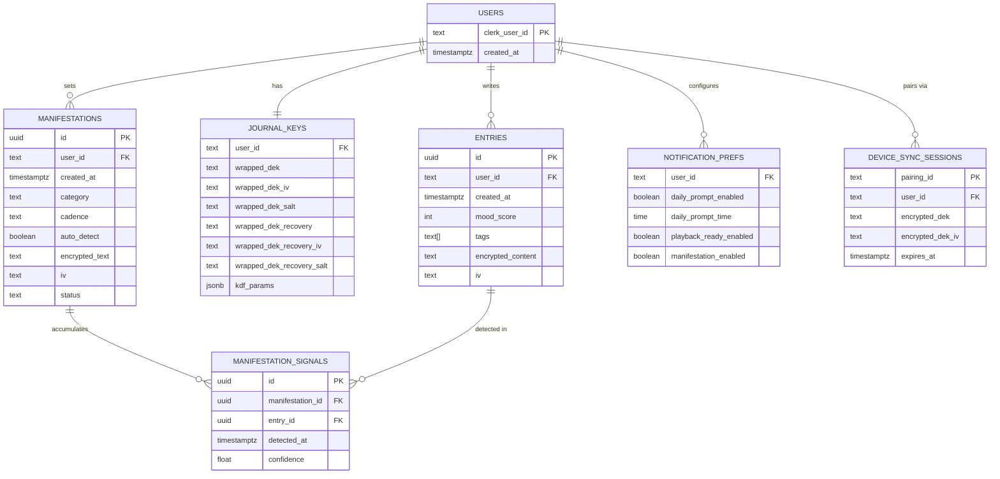

Design rule: only the metadata a query genuinely needs (mood score, tags, timestamps, cadence/status flags) is stored in the clear. Anything that is the user's actual words — entry content, manifestation text — is stored only as `(encrypted_content, iv)`, encrypted client-side before it ever reaches the network.

Ciphertext/key-material columns are `text` (base64), not `bytea` — see `0002_ciphertext_as_text.sql`. The original `bytea` choice assumed Postgres would hold raw binary, but everything in `src/lib/crypto` produces base64 strings for JSON transport anyway, and PostgREST's `bytea` wire format (hex-encoded) doesn't match that without extra encoding work that buys nothing here.

`device_sync_sessions` (`0003_device_sync.sql`) is deliberately ephemeral — see §5's multi-device note and §6.7.

## 5. Encryption architecture

The threat model: the operator (database, backend code, and anyone who compromises either) should not be able to read journal entries, even under legal compulsion or a data breach.

Two independent secrets, by design:

- **Account password** (Clerk) — proves who you are. A reset here does not touch journal data.
- **Journal passphrase** (app-specific, set in a dedicated onboarding step, distinct from Clerk) — the only thing that unlocks entries. There is no server-side reset path; losing it and the recovery code means permanent loss of the archive. This is a stated tradeoff, not an oversight — see the Recovery Code screen copy in the design canvas.

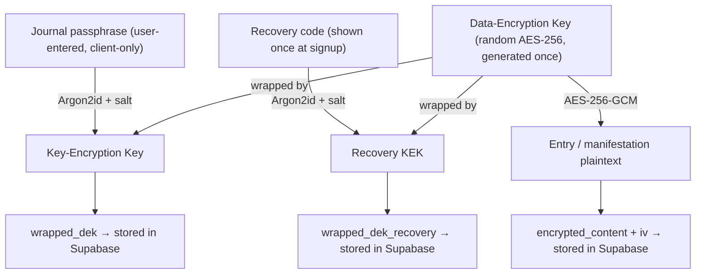

Consequences that follow from this model, worth stating explicitly for implementation:

1. **The server never persists plaintext.** The one exception is transient, in-memory handling during an AI call (§6.4) — never logged, never written to disk or a database row.
2. **AI-generated output derived from plaintext is itself sensitive.** A playback narrative or a detected manifestation signal is generated from decrypted content. If it's cached server-side for reuse, it must be re-encrypted client-side with the DEK before that round-trip — it does not get a free pass just because the AI produced it rather than the user.
3. **Multi-device sync doesn't touch this model at all — it's a parallel path.** Re-entering the passphrase always works (same `wrapped_dek` row, any device). For a faster handoff, an already-unlocked device can transmit the DEK to a new one via a short-lived, server-relayed exchange encrypted under a one-time "channel key" that's generated on the new device and never sent to the server — see §6.7. The server only ever holds that ciphertext, briefly.

## 6. Sequence diagrams

### 6.1 Account signup + journal passphrase setup

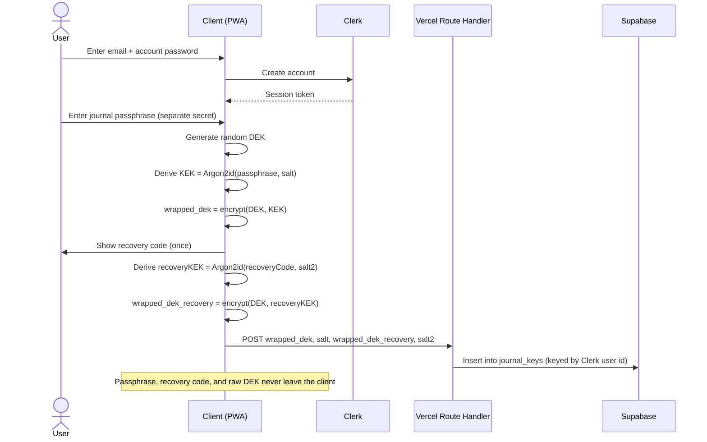

### 6.2 Login + unlock

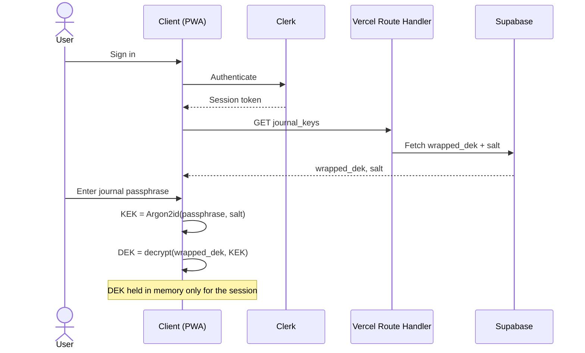

### 6.3 Create a journal entry

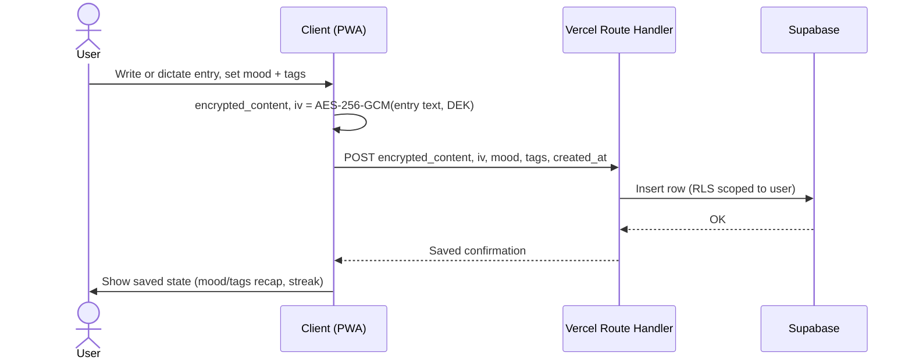

### 6.4 AI prompt / playback generation

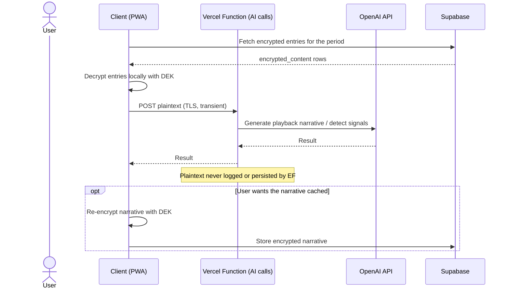

### 6.5 Voice entry

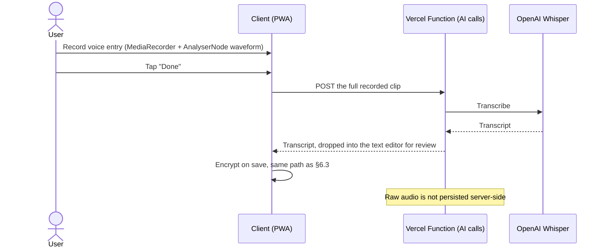

Deliberately **batch, not live-streaming**: the waveform shown while recording is real (genuine audio levels via `AnalyserNode`), but the transcript only appears after "Done" — Whisper's REST API has no incremental-result mode. True live, word-by-word transcription would need OpenAI's Realtime (WebSocket) API, evaluated and explicitly deferred as a materially bigger swap than this covers.

### 6.6 Daily reminder notification

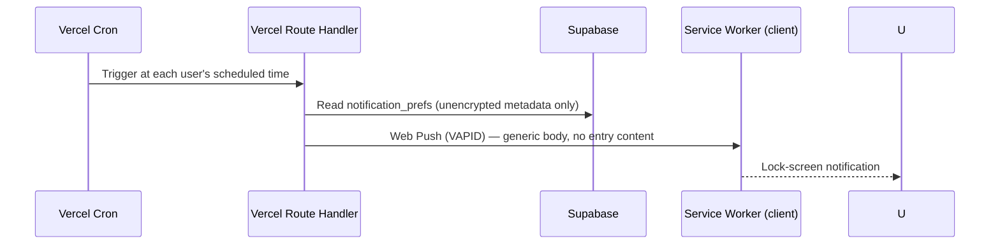

Note: the lock-screen mockup in the design canvas shows descriptively rich preview text (e.g. quoting the day's prompt). That's illustrative of the *feature*, not a settled decision — see the open question in §8 about notification content richness vs. lock-screen exposure.

### 6.7 Multi-device key sync

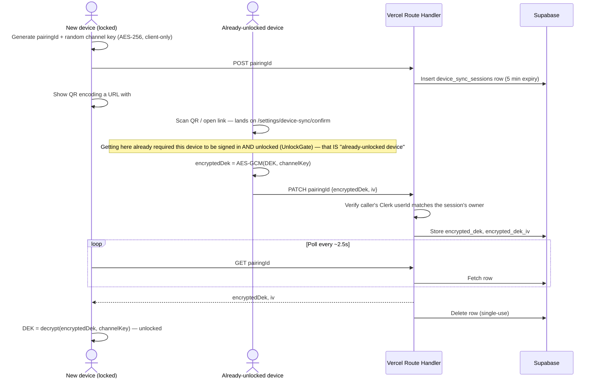

The server only ever holds `encrypted_dek` — ciphertext under a key it never sees, for at most 5 minutes, deleted on pickup. This runs alongside passphrase/recovery-code unlock as a third option, not a replacement for either.

## 7. System architecture

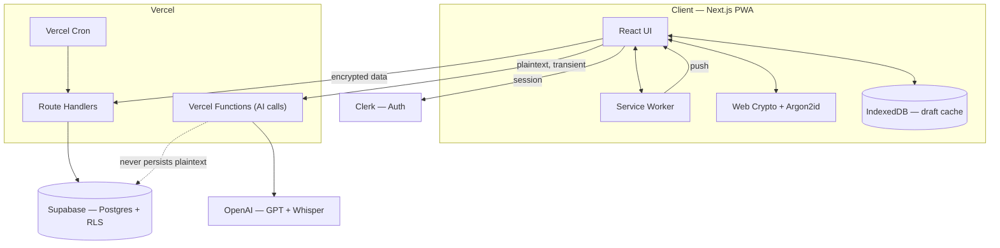

This diagram shows the intended shape, not a claim that every box is live: `SW` (service worker) and `IDB` (IndexedDB draft cache) are designed but not yet wired, and `Cron` isn't configured — see §8 for the concrete gap list.

## 8. Security boundaries & explicit non-goals

- The database and backend code never store readable entry content. The only place plaintext exists outside the client is transiently inside a Vercel Function during an AI call.
- Account password (Clerk) and journal passphrase are independent. Compromising or resetting one does not expose data protected by the other.
- There is no "forgot journal passphrase" server-side reset. The recovery code is the only backup path, by design — this is a stated cost of the privacy model, not a gap to close.
- Resolved since the last pass:
  - **Multi-device key handling.** Built — see §6.7. QR-code handoff between an already-unlocked device and a new one, server-relayed but never server-readable.
  - **Data export / account deletion.** Built, in Settings. Export decrypts everything client-side and downloads JSON — no server route needed, since the server never had anything but ciphertext. Deletion is type-to-confirm, wipes every Supabase table for the user, then deletes the Clerk account itself (data first, while the session's still valid; Clerk account last, since that's irreversible).
  - **Whisper audio retention.** Confirmed as implemented: `VoiceRecorder` sends the recorded blob directly to `/api/ai/transcribe` and neither side writes it anywhere. Also now explicitly *not* live-streaming — see §6.5.
- Still open (flag before building the relevant piece):
  - **Notification content richness vs. lock-screen privacy.** The lock-screen mockup shows descriptive previews; decide whether shipped notifications stay generic ("Time to reflect") or allow rich previews with a Settings toggle to suppress them on the lock screen. Moot until Vercel Cron + Web Push are actually wired (`notification_prefs` stores the preference; nothing triggers a push yet).
  - **Offline write conflict handling.** The composer currently holds its text in plain React state — a dropped connection or refresh mid-entry loses it. The IndexedDB draft-cache idea in §3/§7 is still just a plan, not implemented; there's no sync-back/conflict-resolution behavior to design until the cache itself exists.
  - **PWA installability.** Serwist is installed but no service worker is registered — no offline app-shell caching, no installable-to-home-screen behavior yet.

## 9. Screen inventory

Full visual reference: [Journal App Mobile Flow](https://claude.ai/code/artifact/36d63c97-7c7c-4fd6-8234-b35ea36ed857). This table describes the design canvas as designed — where implementation deliberately diverged (voice transcription is batch, not the live streaming shown in the mockup; see §6.5), the mockup description stays as the original intent and the actual behavior is documented where it's implemented. For current build status per area, see [`web/README.md`](../web/README.md)'s "What's built" / "Known gaps" lists.

| Screen | Purpose |
|---|---|
| Account signup (Clerk-style) | Email/password or social login, creates the Clerk account |
| Journal passphrase setup | Sets the separate encryption secret |
| Recovery code | One-time display of the account's only backup path |
| Tone selection | Coach / Friend / Mirror / Minimal |
| Notification permission | Soft pre-permission ask, per-notification-type toggles |
| Lock screen notification (mockup) | Illustrates push notification appearance |
| Home | Daily prompt, mood check-in, streak, recent entries |
| Journal list | Dated list of past entries, grouped by month |
| Entry detail | Long-form reader for a full past entry |
| Entry composer | Text entry with mood + tags |
| Entry composer — voice | Live waveform, timer, streaming transcript |
| Entry composer — saved | Confirmation state, privacy reassurance, streak update |
| Playback hub | Week/month/year recap selector |
| Playback story cards (×4) | Mood trend, highlighted quote, then-vs-now, letter from past self |
| Manifestations list | Goals with AI-detected progress signals |
| Manifestation add/edit | Goal text, category, resurfacing cadence, auto-detect toggle |
| Settings | Tone, encryption/privacy, notifications, account |

## 10. AI cost optimization & semantic search

Status: **partially implemented.** The daily-prompt cache (§10.2) is built; everything else in this section is still a design proposal. This section is written to the same standard as the rest of this document — it should be treated as the source of truth for intent once any part of it starts landing, and updated (not left to drift) as pieces ship.

### 10.1 Current AI call inventory

All calls go through `src/lib/ai/openai.ts` (`gpt-4o-mini` for text, `whisper-1` for audio). Only the prompt route is cached; the other three have no caching, and none of the four have rate limiting or usage tracking (§10.6.3, still open).

| Route | Trigger | Input sensitivity | Cacheable? |
|---|---|---|---|
| `GET /api/ai/prompt` | Home screen load (`useDailyPrompt`, `staleTime: Infinity` client-side only) | None — `generateDailyPrompt(tone, [])` is called with an always-empty entries arg | **Implemented** — see §10.2 |
| `POST /api/ai/playback` | "Play Your Week/Month/Year" tap | High — decrypted entry text, transient | Yes, per `(user, period, entry set)` |
| `POST /api/ai/detect-signals` | Every entry save (fire-and-forget) | High — decrypted entry + manifestation text, transient | No — must run per entry to do its job |
| `POST /api/ai/transcribe` | Voice entry "Done" | High — raw audio, transient | No — unique audio each time |

### 10.2 Caching strategy per call site

**Daily prompt — implemented.** Because `recentEntrySummaries` is hardcoded to `[]` (`src/app/api/ai/prompt/route.ts`'s own comment marks personalization as unbuilt), the output is identical for every user sharing a `(tone, date)` pair — i.e., at most 4 distinct outputs exist on any given day, but every user independently paid for their own generation of one of those 4. Cached by `(tone, cache_date, template_version)` in a new `prompt_cache` Supabase table (`supabase/migrations/0004_prompt_cache.sql`), a plain table rather than a new KV/Redis vendor, per §10.6.5's recommendation:

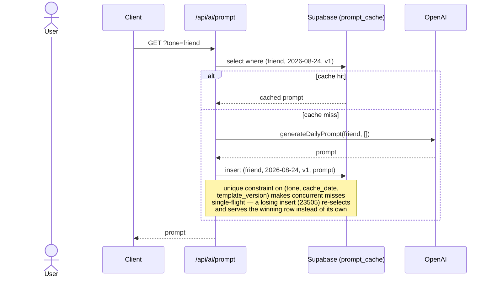

Collapses N users/day to ≤4 OpenAI calls/day. `cache_date` is the UTC calendar date — an explicit, simple day boundary (§10.6.1 flagged this as ambiguous if left implicit); a user near UTC midnight may see the prompt change at a time that doesn't match their local midnight, accepted for now. `template_version` (`DAILY_PROMPT_TEMPLATE_VERSION` in `src/lib/ai/openai.ts`) lets a future prompt-engineering change invalidate old cache rows immediately instead of waiting out up to 24h of staleness.

**Deliberately not CDN/edge-cached.** The original proposal suggested `Cache-Control: public, s-maxage=86400` so Vercel's edge could serve repeat requests without invoking the function at all. Dropped during implementation: this route is gated by an `auth()` check, and a CDN-level cache hit never re-executes the origin function — so a publicly cacheable response on an authenticated route would let a cached hit bypass the auth check entirely for any caller, not just authenticated ones. The Supabase-backed cache still gets the real win (≤4 OpenAI calls/day); it costs one DB round trip per request instead of a free CDN hit, which is the right trade for keeping the auth check load-bearing.

**This caching is only valid because the prompt is unpersonalized** — the moment `recentEntrySummaries` is wired up, output becomes per-user and falls under the re-encrypt-before-persisting rule in §5, point 2, and this whole cache design must be revisited.

**Playback narrative.** No caching exists; every "Play Your Week" tap re-generates, even for an unchanged period. Entries have no update path (§10.6.2) — the only route for an entry ID is `DELETE`, no `PATCH` — so a cache key of the sorted entry ID set alone (no content-hash or `updated_at` needed) is sufficient and stable. Client-side cache (IndexedDB, keyed by `hash(entry ids, tone)`) is the low-risk version: zero new infrastructure, and it's the client's own already-decrypted data. A cross-device version (small `playback_cache` table storing `(encrypted_narrative, iv)` per §6.4's existing "opt" note) is a real follow-up but not necessary for the cost win.

**Signal detection.** Already skips the call entirely with zero active manifestations. The remaining lever isn't caching — see §10.6.4 (uncapped entry length).

**Transcription.** No caching axis; each recording is unique.

### 10.3 Semantic search — design options

Computing an embedding requires plaintext, and a queryable similarity index requires the vectors to sit somewhere a similarity function can reach them. Both are in tension with §5's threat model ("the operator... should not be able to read journal entries... even under legal compulsion"). Embeddings are not plaintext, but they are known to be partially invertible — recent research recovers meaningful content from embedding vectors — so this document treats them as sensitive as the entries themselves, not as harmless derived data.

| Option | Where embeddings are computed | Where search runs | OpenAI cost/entry | Compatible with §5's threat model |
|---|---|---|---|---|
| **A — Client-side model** | In-browser (transformers.js, quantized MiniLM-class model) | In-browser, cosine similarity over cached vectors | None | Yes |
| **B — Server-assisted, client search** | Vercel Function via OpenAI embeddings API, transient plaintext (mirrors §6.4) | In-browser — vectors are pulled down and decrypted, same as A | Yes, per entry | Yes, but only if search itself stays client-side (see §10.6.6) |
| **C — Server-side plaintext/vector index** (pgvector, Pinecone, etc.) | Server | Server | Yes | **No — rejected.** An unencrypted, queryable semantic index of the journal is the exact thing §5 promises won't exist. |

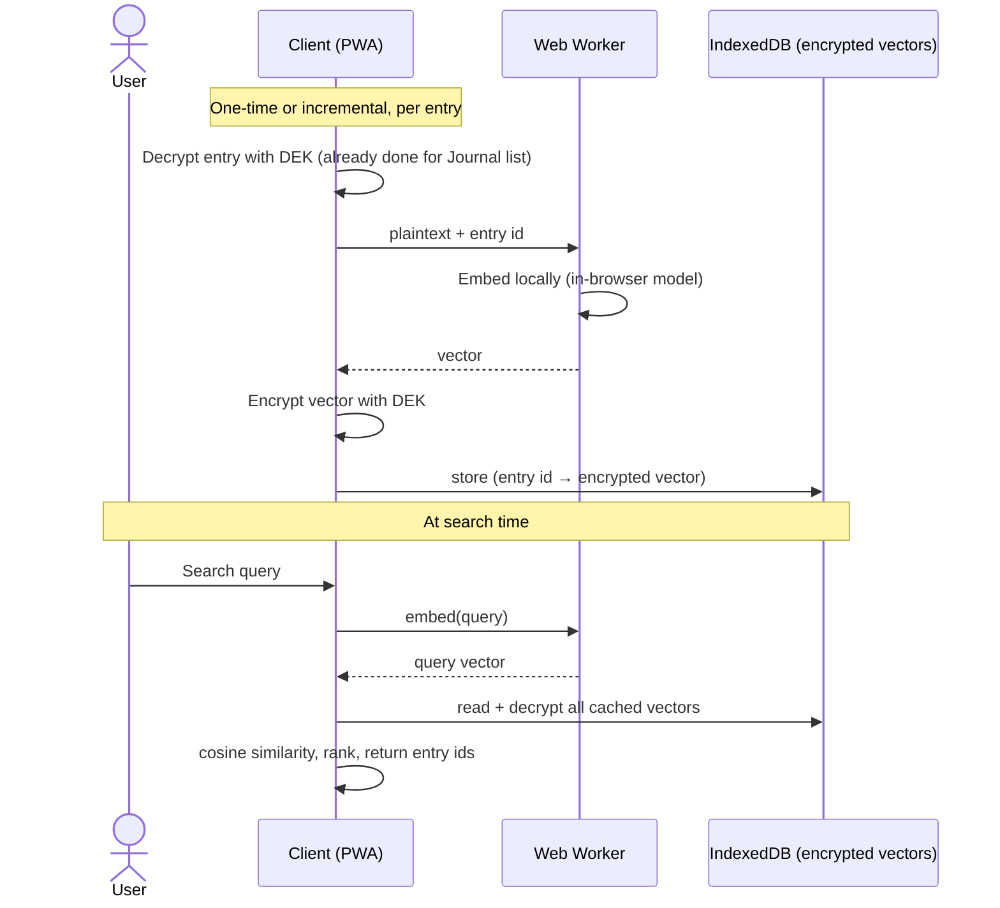

### 10.4 Recommendation

Option A. It is the only option with zero incremental OpenAI cost, the only one that doesn't touch the zero-knowledge promise at all (server never sees plaintext or vectors, full stop — no "transient" caveat needed), and journal search doesn't need enterprise-RAG-grade relevance to be useful. Build scope is a client-side lib, an encrypted IndexedDB store, and a search UI — no new backend surface.

### 10.5 Recommended sequencing

1. **Daily prompt cache** — done (§10.2). Smallest change, real savings starting day one, no encryption questions.
2. **Rate limiting + usage logging on all four `/api/ai/*` routes** (§10.6.3) — currently absent entirely; do this before, not after, shipping anything that increases call volume.
3. **Spike: in-browser embedding quality** on real (or realistic) journal text — cheap to test, de-risks the whole semantic search feature before committing UI or a storage schema.
4. **Playback narrative client-side cache** — nice-to-have, lower urgency than the above.
5. **Semantic search UI**, only after step 3 validates quality.

### 10.6 Critical review & open risks

This section exists to stress-test §10.1–10.5 rather than let the proposal stand unchallenged — in the same spirit as §8's "still open" list.

**10.6.1 — Daily prompt cache: day-boundary and stampede issues — addressed in the implementation, one tradeoff accepted deliberately.** "Date" is ambiguous across timezones; the implementation picks UTC midnight as an explicit, simple cutover rather than leaving it implicit. A user near that boundary sees the prompt "change" at a time that doesn't match their local midnight — accepted, not fixed, since a per-user local-date key would give up most of the 4-per-day collapse (approaching one cache entry per timezone-offset × tone instead of 4 total). Concurrent cache-miss requests at day rollover are handled by the database's own unique constraint on `(tone, cache_date, template_version)`, not application-level locking: a losing concurrent insert fails with a unique-violation error, and that caller re-selects and serves the winning row instead of generating a second time — genuinely single-flight, not just check-then-write. `template_version` is in place so a future prompt-engineering change can invalidate stale rows immediately rather than waiting out up to 24h.

**10.6.2 — Playback cache: the original draft of this proposal (in conversation, before this doc) assumed an `updated_at` column on `entries` for invalidation. It doesn't exist** — `entries` has no update path at all (0001_init.sql defines only `id, user_id, created_at, mood_score, tags, encrypted_content, iv`; the only per-entry route is `DELETE`). This actually makes the cache key simpler than first proposed (entry ID set alone, no timestamp needed) — but it's worth flagging that this simplification is contingent on entries staying immutable. If entry editing ships later, this cache invalidation logic silently goes stale unless someone remembers to revisit it.

**10.6.3 — No cost circuit breaker exists anywhere in this proposal.** All four routes currently have no rate limiting, no per-user or global spend cap, and no usage logging (verified: no rate-limit or KV/Redis dependency in `package.json`). Caching reduces average cost but does nothing to bound worst case — a bug in a client retry loop, or a user with a scripted client, can still call any of these routes without limit. Recommend: (a) a lightweight per-user rate limit on all four routes (even a crude fixed-window counter is better than nothing), (b) logging `response.usage` token counts (metadata only, never content) so cost is measured rather than guessed, and (c) a soft daily spend ceiling that degrades to a "try again later" response rather than an open-ended bill. None of this is optional if the goal is genuinely "reduce and control cost," not just "reduce average cost."

**10.6.4 — Entry length is uncapped, unlike manifestation text.** `ManifestationForm.tsx` caps input at 200 characters; the journal entry composer (`write/page.tsx`) has no `maxLength` at all. Both `/api/ai/playback` and `/api/ai/detect-signals` send full entry text to OpenAI, so token cost per call scales unboundedly with what a user chooses to write. A sane cap (a few thousand characters) bounds worst-case cost per call and is cheap insurance against both accidental and deliberate abuse — but it's a product decision, not just an engineering one (a journal app capping entry length is a real UX constraint), so it needs sign-off, not just implementation.

**10.6.5 — The caching proposal quietly introduces a new infrastructure dependency the stack table (§3) doesn't have today.** §3 states the explicit non-choice "no separate backend framework/service." A KV/Redis-backed cache (Vercel KV, Upstash) is a new vendor. A Postgres-table-backed cache (a `prompt_cache` table in the existing Supabase instance) is zero new vendors and fits the stack's stated philosophy better, at the cost of slightly higher read latency than a dedicated KV store. Recommend starting with the Supabase-table version and only reaching for KV if read latency is measured to actually matter — not assumed upfront.

**10.6.6 — The client-side embedding store as described breaks an invariant the rest of the app holds carefully.** Everywhere else, nothing derived from plaintext survives a reload without the passphrase — the DEK is memory-only by design (§6.2: "DEK held in memory only for the session"). An unencrypted vector cache in IndexedDB would be the one exception: a persistent, on-disk artifact that's adjacent to entry content, readable by anything with local disk/browser-storage access (malware, a browser extension, a subsequent user of a shared device) without ever needing the passphrase. §10.3's diagram already shows encrypting the cached vector with the DEK before storage — that decision needs to be treated as non-negotiable, not an optional hardening step, or this feature quietly weakens the app's core privacy claim.

**10.6.7 — Performance and footprint risks for a "mobile-first PWA" are real and unaddressed by §10.4 alone.** A quantized in-browser embedding model is commonly tens of MB — a meaningful download on mobile data for a PWA whose stated identity is lightweight and installable. Compounding this: §8 already lists "no service worker registered" as an open gap, so there's currently no mechanism to cache that model download across sessions the way a PWA normally would. Embedding hundreds of entries on-device is also real CPU work that will visibly block the UI if run on the main thread. Recommendations: lazy-load the model only on first search use (never on app load), make search an opt-in setting rather than always-on, run embedding computation in a Web Worker, and treat "register a service worker" as a practical prerequisite to sequence before or alongside this, not after.

**10.6.8 — Multi-device search is an accepted gap, not a solved one.** §6.7 (multi-device key sync) has no awareness of a client-side vector cache — a newly-synced device starts search from zero and must re-embed the entire archive before search works there. This should be stated as an explicit, accepted limitation in the search feature's own design rather than discovered later as a bug report.

**10.6.9 — Model hosting is an undecided operational detail, not a footnote.** transformers.js fetches its model from a HuggingFace CDN by default at runtime. For a PWA that wants any offline capability, this is a third-party runtime dependency for a core feature and should be vendored/self-hosted rather than left as an implicit default.

**10.6.10 — In-browser embedding quality for this specific use case is unvalidated.** MiniLM-class models are a real step down from OpenAI's embedding models, and journaling text (personal, sometimes non-English, often short and colloquial) isn't the domain these small models are typically benchmarked on. §10.5 already sequences a quality spike before the full feature — that ordering is load-bearing, not a nice-to-have. Do not commit to a storage schema or ship search UI before that spike has a real answer.
